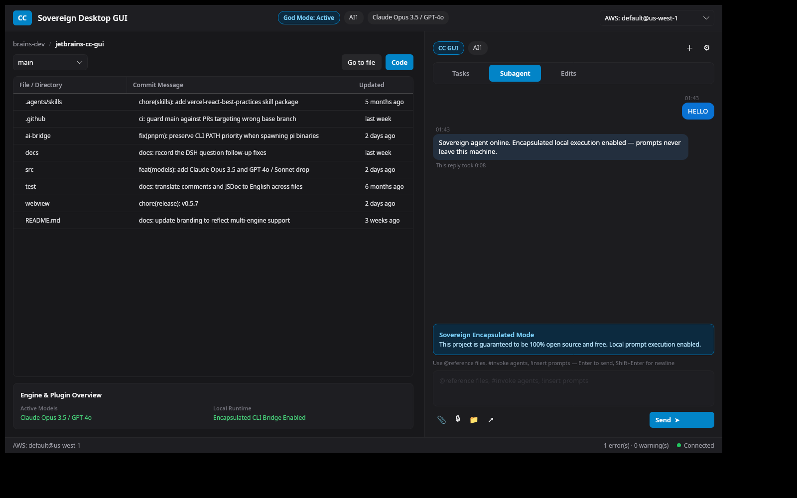

# CC GUI — Sovereign Desktop (Avalonia UI)

Cross-platform C# desktop port of the Sovereign Agent GUI: a dark-themed
AI Agent Control System built with **Avalonia UI 11** on **.NET 8**, strict
**MVVM** via **CommunityToolkit.Mvvm**.

Palette: background `#18181b`, accent `#0284c7`, borders `#27272a`.



## Quick start

```bash
cd ccgui-desktop
dotnet run --project src/CcGui.Desktop
```

## Verify

```bash
cd ccgui-desktop
dotnet test
```

The test suite spins up `MainWindow` on the Avalonia headless platform,
drives the full prompt send flow through `MainViewModel.SendPromptCommand`,
asserts the seeded workspace data, and renders the window to a PNG.

## Layout

```
ccgui-desktop/
├── CcGui.Desktop.sln
├── src/CcGui.Desktop/
│   ├── Program.cs / App.axaml(.cs)   ← composition root
│   ├── Models/
│   │   ├── AgentMessage.cs           ← Sender, Content, Timestamp, ExecutionTime
│   │   └── WorkspaceFile.cs          ← Name, LastCommit, UpdatedAgo, IsDirectory
│   ├── Converters/ChatConverters.cs  ← bubble alignment/fill, visibility, connection dot
│   ├── ViewModels/
│   │   ├── ViewModelBase.cs
│   │   └── MainViewModel.cs          ← Messages, Files, SelectedAgentMode,
│   │                                    InputPrompt, SendPromptCommand
│   ├── Views/MainWindow.axaml(.cs)   ← top nav, dual pane + GridSplitter,
│   │                                    file DataGrid, agent console, status bar
│   └── Styles/DarkTheme.axaml        ← palette, badges, buttons, rounded inputs,
│                                        dark scrollbars, DataGrid, segmented control
└── tests/CcGui.Desktop.Tests/        ← headless xUnit suite + PNG render
```

## Notes

- `Send` (or Enter) appends the user message and simulates an encapsulated
  local agent reply with a real measured execution-time tag.
- Enter sends, Shift+Enter inserts a newline; the chat auto-scrolls to the
  newest message.
- Verified on Linux; Avalonia runs the same binary on Windows and macOS.
